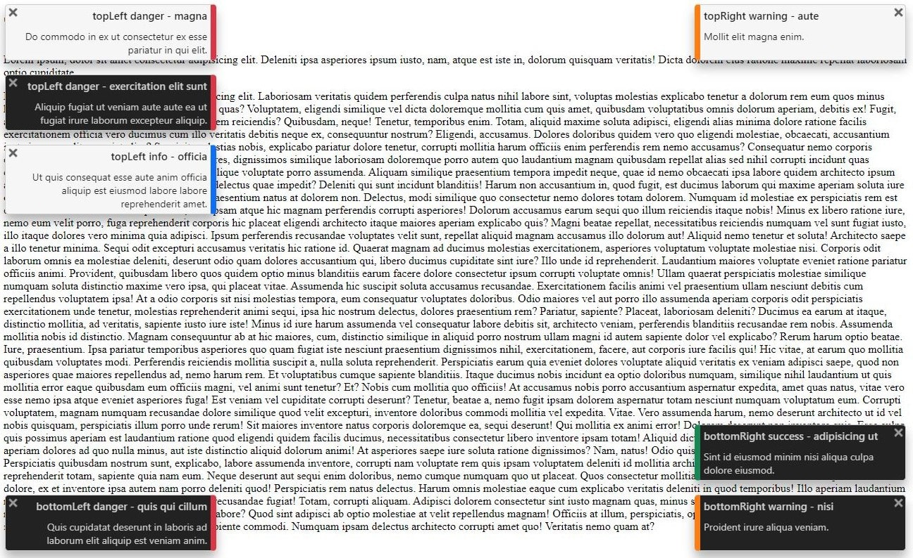

# js-toaster

Agnostic and responsive notifications javascript module

[](http://npm.im/test-vite-vite)
[](https://github.com/vnabet/js-toaster/actions/workflows/publish.yml)



- [Demonstration on jsfiddle site](https://jsfiddle.net/vnabet/owvh2c84/46/show)

## Installation

```js
npm i js-toaster
```

## Usage

### Imports

With a bundler like webpack:
```js
import 'js-toaster/jsToaster.css'
import { jsToaster } from 'js-toaster';
```

You can import sources too from [unpkg.com](https://unpkg.com/browse/js-toaster/):
```html
<link rel="stylesheet" href="https://unpkg.com/js-toaster@0.6.0/jsToaster.css">
<script type="module">
  import { jsToaster } from 'https://unpkg.com/js-toaster@0.6.0/jsToaster.min.js';

  ...
</script>
```

### Send Notification

You can just send a notification with a text (the toast will be sent with the default or override configuration)...
```js
const id = jsToaster.toast('My notification text');
```

...or passing as a parameter a complete toast object
```js
const id = jsToaster.toast({
  message: 'My notification text',
  title: 'My notification title',
  link: string | boolean //URL or boolean
  displayTime: 20, //seconds. 0 if there is no end
  dark: true | false, //Toast dark mode
  position: 'topLeft' | 'topRight' | 'bottomRight' | 'bottomLeft',
  type: 'info' | 'success' | 'warning' | 'danger' //Define the color of the toast
});
```
**Important note**: Only the `message` is required. The `title` and `link` can be empty. Other properties are optional and take as value those of the [configuration](#configuration).

About the `link` property:
 - A URL generates a redirection on clicking the toast.
 - A `true` value triggers a click event ([see below](#click-events)) on clicking the toast. The toast is closed after the click.

`jsToaster.toast` function returns a toast identifier. This `id` is a number and is a useful reference when clicking on a toast.

### Configuration

You can override default toaster configuration
```js
jsToaster.conf = {
  displayTime: 20, //DEFAULT 20 - seconds. 0 if there is no end
  dark: true | false, //DEFAULT false - Toast dark mode
  position: 'topLeft' | 'topRight' | 'bottomRight' | 'bottomLeft', //DEFAULT 'topRight'
  type: 'info' | 'success' | 'warning' | 'danger', //DEFAULT 'info' - Define the color of the toast
  marginTop: 0, //DEFAULT 0 - Allows you to define a top margin for toasts displayed in 'topLeft' and 'topRight' positions
  marginBottom: 0, //DEFAULT 0 - Allows you to define a bottom margin for toasts displayed in 'bottomLeft' and 'bottomRight' positions
  mobilePosition: 'top' | 'bottom', //DEFAULT 'bottom' - On mobile devices, all toasts are stacked at the top or bottom
  mobileMargin: undefined, //DEFAULT `undefined` - Define the top or bottom margin on mobile devices 
};
```
**note**: all properties are optional.

About the `mobileMargin` property:

It overrides the default `marginTop` or `marginBottom` values on mobile devices.

| `mobileMargin`| `mobilePosition`| css margin-top  | css margin-bottom |
|:--------------|-----------------|-----------------|-------------------|
| undefined     | `top`           | `marginTop`     | 0                 |
| undefined     | `bottom`        | 0               | `marginBottom`    |
| number        | `top`           | `mobileMargin`  | 0                 |
| number        | `bottom`        | 0               | `mobileMargin`    |

### Click events

If you define a `true` value for the `link` property of a toast, a click on this one triggers a click event.

These events can be captured using the function `jsToaster.onClickToast` to register handlers with toast id as parameter.

```js
jsToaster.onClickToast((id) => {
  console.log('TOAST CLICKED', id);
})
```

### Close events

A toast closed or hidden triggers a close event.

These events can be captured using the function `jsToaster.onCloseToast` to register handlers with toast id as parameter.

```js
jsToaster.onCloseToast((id) => {
  console.log('TOAST CLOSED', id);
})
```
